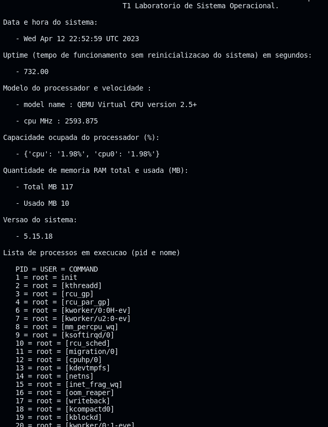

# Eduardo Spode Cardoso & Gilberto Luis Koerbes Junior

# Tutorial - HttpSystemInfoServer
### Definições do trabalho:

Os alunos podem realizar esta atividade em duplas ou individualmente. 
Como entrega, será solicitado um tutorial de implementação descrevendo todos os passos necessários para a implementação do trabalho, de forma que outras pessoas possam reproduzi-lo (assim como é feito com os tutoriais de aula). 
Além disso, todo o desenvolvimento deve ser adicionado ao repositório de fontes e passar a fazer parte da distribuição.

[Definições do trabalho](./httpServer/tp1.pdf)

## PROJETO
### PRÉ REQUISITOS:

Para execução do projeto, assumimos que você já tenha concluído algumas etapas anteriores (tutoriais) que exigem:

* Habilitado um Driver de Ethernet
* Configurado o script de inicialização da interface de rede -> [Pasta de script](./custom-scripts/) 


## Etapas adicionais no nosso projeto
Incluímos no nosso projeto algumas configurações em ```make menuconfig```:

- Habilitar o uClibc-ng:
``` 
    --> Toolchain
        --->C libary 
            ---->(*) uClibc-ng
```
- Habilitar o W CHAR:
```
    --> Toolchain
        --->[*] Enable WCHAR support
```
- Habilitar o Python
```
    -->Target Pakets
        --->Interpreter languages and scripting
            ---> [*] python3
```

Realize o comando:

```make clean```

E depois o comando:

```make MAKEINFO=false```

# Target
Para rodar emulador do target utilize

```
sudo qemu-system-i386 --device e1000,netdev=eth0,mac=aa:bb:cc:dd:ee:ff --netdev tap,id=eth0,script=custom-scripts/qemu-ifup --kernel output/images/bzImage --hda output/images/rootfs.ext2 --nographic --append "console=ttyS0 root=/dev/sda"  
```

Crie uma pasta no _TARGET_ para guardar os arquivos necessários para o HTTP Server em python.

``mkdir webserverfiles``

Acessando a pasta: 

``cd webserverfiles``

E crie um arquivo dentro da pasta:

``vi httpServer.py``.

Insira o código do repositório  [httpServer.py](./httpServer/httpServer.py). 


É necessário o código auxiliar [cpustat.py](./httpServer/cpustat.py); Crie na mesma pasta:

``vi cpustat.py``

Insira o código disponibilizado em [cpustat.py](./httpServer/cpustat.py)

Para executar o servidor HTTP, rode o comando

``python /root/webserverfiles/httpServer.py``

# HOST

Com o servidor HTTP rodando no TARGET, use o shell do HOST e execute o comando:

`` links -anonymous http://<IP-DO-TARGET>:<PORTA-TARGET> ``

Use -anonymous para evitar o uso de cache do links

## Exemplo

`` links -anonymous http://192.168.1.10:8000 ``

Saída



## Comentários sobre o projeto

- Principais imports necessários:

```python
import time
from http.server import BaseHTTPRequestHandler,HTTPServer
import os #PERMITE CHAMADAS DE SISTEMA
import cpustat as cpustat #IMPORTA O ARQUIVO PARA VERIFICAR CPU
```

Principais comandos para obter informações no servidor:

```python
        datahora = os.popen('date').read() #Verifica hora no servidor
        systime = os.popen("awk '{print $1}' /proc/uptime").read()  #imprime o tempo de atividade
        cpuModel = os.popen("cat /proc/cpuinfo | grep 'model name'").read() #informações modelo de CPU
        cpuCores = os.popen("cat /proc/cpuinfo | grep 'cpu MHz'").read() # velocidade da CPU buscando filtro de CPU MHz
        memRamUsada = os.popen("free -m | grep 'Mem' | awk '{print $3}'").read() #exibe diversas infomações da memoria e processa a coluna de 'Used'
        memRamTotal =  os.popen("free -m | grep 'Mem' | awk '{print $2}'").read()#exibe diversas infomações da memoria e processa a coluna de 'Total'
        sysVersion = os.popen("uname -a | cut -d ' ' -f3)".read() #uname exibe informções do kernel e o cut 'corta' em colunas
        listProc = os.popen("ps aux | awk '{print $1 \" = \" $2 \" = \" $3 \"<br>\"}'").read() # lista todos os processos de todos os usuários. Note: o <br> não é nativo. Utilizamos para formatação HTML.

        cpu = cpustat.GetCpuLoad() #Exibe o load/ uso em porcentagem de cada cpu.
```

A principal biblioteca ***os*** possui um metodo muito útil, o **os.popen** que permite executar comandos no shell e obter seu output. Por exemplo:
```os.popen('date').read()``` retorna a hora no servidor com o comando ```date``` no shell.
A partir disso, utilizamos vários comandos nativos shell  para pre-processamento de dados como:

```bash

cat  #exibe informação de um arquivo
grep #fitra palavras em arquivos ou em stdin
awk # processa e exibe colunas
cut # semelhante ao awk
| #pipe  permite 'ligar' comandos

```

A partir disso, salvamos os vários comandos em variaveis e montamos o HTML. 

_**A cada novo request, os metodos são chamados e atulizados em tempo real os dados do servidor**_

